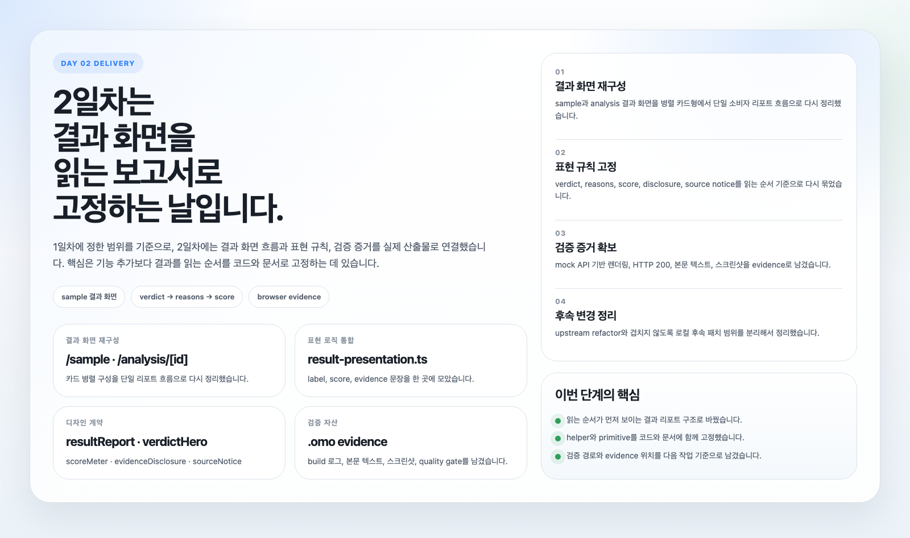

# Day 02 Delivery Report

## 목적

2일차의 목표는 1일차에 고정한 범위를 실제 결과 화면과 검증 가능한 산출물로 연결하는 것이다.  
즉, “무엇을 만들지”를 다시 정하는 단계가 아니라, 사용자가 바로 읽을 수 있는 결과 리포트 흐름과 그 근거를 실제 코드와 증거로 남기는 단계다.

## 이번에 완료한 범위

- 결과 화면 재구성:
  - `/sample`
  - `/analysis/[id]`
- 결과 리포트 흐름 고정:
  - verdict
  - reasons
  - score insight
  - map evidence
  - disclosure
  - source notice
- 보고서형 표현 규칙 정리:
  - 한국어 소비자 문장 중심
  - helper 기반 표현 로직 통합
  - `DESIGN.md` primitive 문서화
- 로컬 작업 규칙 추가:
  - `toss/es-toolkit`를 참고한 repo-local guidance skill 추가

## 결과 화면에서 달라진 점

### 읽는 순서가 명확해졌다

- 기존처럼 카드가 병렬로 흩어진 구성이 아니라, 위에서 아래로 읽는 리포트 흐름으로 정리했다.
- 사용자는 점수보다 먼저 “이번 위치를 어떻게 판단했는지”를 문장으로 확인할 수 있다.

### 표현 로직이 한 곳으로 모였다

- recommendation label
- data mode label
- score summary
- evidence 문장

위 항목을 `result-presentation.ts`로 모아, 같은 의미를 화면마다 다르게 표현하던 문제를 줄였다.

### 디자인 계약이 문서로 고정됐다

아래 primitive를 `DESIGN.md`에 명시했다.

- `resultReport`
- `verdictHero`
- `scoreMeter`
- `evidenceDisclosure`
- `sourceNotice`

이후 결과 화면을 수정하더라도, 같은 리포트 문법을 기준으로 확장할 수 있다.

## 검증과 증거

### 프론트엔드 검증

- `pnpm --filter commercial-area-analysis-web build`
  - 통과
- mock API를 분리한 뒤 `/sample` 화면을 실제 렌더링으로 확인
  - HTTP 200 확인
  - 본문 텍스트 저장
  - 전체 화면 스크린샷 저장

### 증거 파일

- `.omo/evidence/day2-es-toolkit-ui-build.log`
- `.omo/evidence/day2-es-toolkit-ui-happy-head.txt`
- `.omo/evidence/day2-es-toolkit-ui-happy.txt`
- `.omo/evidence/day2-es-toolkit-ui-happy.png`
- `.omo/evidence/day2-es-toolkit-ui-quality-gate.json`

## 후속 점검에서 확인한 사항

- 로컬에서는 API hardening 패치를 별도로 만들고 검증했다.
- 다만 rebase 과정에서 확인한 결과, 원격 `main`에는 더 큰 refactor가 먼저 반영돼 있었다.
- 그래서 겹치는 API 구조 변경을 다시 억지로 밀어 넣지 않고, 중복 없이 유지되는 범위만 반영하는 쪽으로 정리했다.

정리하면, 오늘 최종 상태의 핵심은 다음 두 가지다.

- day2 루프 결과는 완료 상태로 정리되었다.
- 그 결과를 설명하는 문서와 요약 자산이 현재 저장소 상태에 맞게 보강되었다.

## 오늘 완료 기준

- day2 루프 완료 상태를 설명하는 보고서가 있다.
- 결과 화면 변경의 핵심 흐름이 문서와 이미지로 함께 남아 있다.
- 검증 경로와 증거 파일 위치가 보고서 안에서 바로 추적 가능하다.

## 다음 단계

- 이후 작업은 이 보고서를 기준으로 “결과 리포트 이후 단계”를 확장하면 된다.
- 즉, 다음 변경은 다시 범위를 정의하기보다, 여기 적힌 리포트 구조와 검증 규칙을 유지하면서 이어 붙이는 방식이 적합하다.
